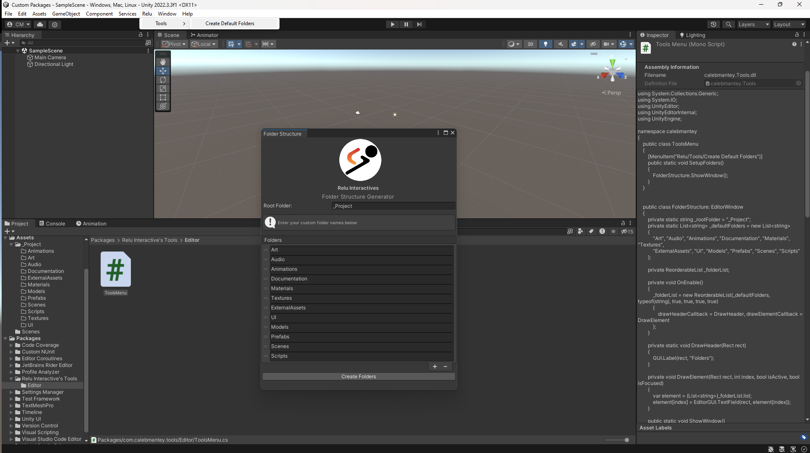

# Relu Interactive Tools

This package is a tool for Unity that automates the creation of folders in the Unity Assets window. This tool simplifies the process of setting up folder structures, saving developers time and effort.

## Table of Contents

- [Relu Interactive Tools](#relu-interactive-tools)
  - [Table of Contents](#table-of-contents)
  - [Installation](#installation)
    - [Option 1: Unity Package Manager (Recommended)](#option-1-unity-package-manager-recommended)
  - [Usage](#usage)
  - [Features](#features)
  - [License](#license)
  - [Contributing](#contributing)
  - [Support](#support)

## Installation

To install Your Package Name, follow these steps:

### Option 1: Unity Package Manager (Recommended)

1. Open your Unity project.
2. Navigate to **Window** > **Package Manager**.
3. Click on the **+** icon.
4. Select **Add package from git URL...**.
5. Enter the following Git URL in the input field: [https://github.com/Caleb-Mantey/Unity-Tools](https://github.com/Caleb-Mantey/Unity-Tools)
6. Click **Add** to import the package into your project.

## Usage

After installing the package, you can access it from the Unity editor:

1. Go to **Window** > **Relu** > **Tools** to open the editor window.
2. Enter a list of folder names you want to create in the Unity Assets window.
3. Click the **Create Folders** button to automatically create the folders.

Note: Make sure to use unique folder names, and folders with the same name will not be created.

## Features

- Easy and automated folder creation in Unity Assets window.
- User-friendly editor window with a list-based interface.
- Saves time and effort in setting up folder structures.

## License

This project is licensed under the [MIT License](LICENSE.md).

## Contributing

We welcome contributions from the community. If you have suggestions or find any issues with the package, please feel free to create a pull request or submit an issue on our GitHub repository.

## Support

If you encounter any problems or have questions about using the package, you can reach out to us through the following channels:

- Email: [manteycaleb@gmail.com](mailto:manteycaleb@gmail.com)
- GitHub Issues: [GitHub Repository Issues](https://github.com/Caleb-Mantey/Unity-Tools/issues)

Happy coding!
